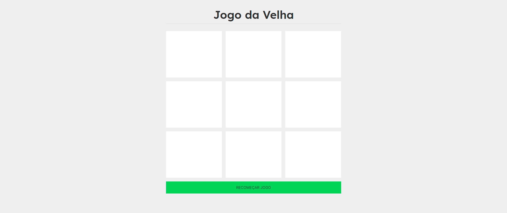

## TicTacToe (Jogo da Velha)

[](https://github.com/mauricio-msp)
[](https://github.com/mauricio-msp/tictactoe/watchers)
[](https://github.com/mauricio-msp/tictactoe/stargazers)
[](https://github.com/mauricio-msp/tictactoe/network/members)
[](LICENSE)

## 🎮 Projeto 
- TicTacToe é um jogo da velha construído com as ferramentas mais atuais do mercado.



## 🚀 Tecnologias

- [Sass](https://sass-lang.com/)
- [ReactJS](https://reactjs.org/)
- [Typescript](https://www.typescriptlang.org/)
- [Next.js](https://nextjs.org/)
- [Api Notification Web](https://developer.mozilla.org/pt-BR/docs/Web/API/Notification)

## 💻 Iniciando

### Requisitos

- Você precisa instalar ambos [Node.js](https://nodejs.org/en/download/) e [Yarn](https://yarnpkg.com/) para executar este projeto.

**Clone o projeto e acesse a pasta**

```bash
$ git clone https://github.com/mauricio-msp/tictactoe.git && cd tictactoe-next
```

**Siga os passos abaixo**

```bash
# Instale as dependências
$ yarn

# Execute o servidor web
$ yarn dev
```

O aplicativo estará disponível para acesso em seu navegador em `http://localhost:3000`

## 📝 License

Este projeto está licenciado sob a Licença MIT - consulte a [LICENSE](LICENSE) arquivo para detalhes.

---

Feito por Mauricio Porfirio 👋 [Confira meu LinkedIn](https://www.linkedin.com/in/mauricio-porfirio-673857105/)
